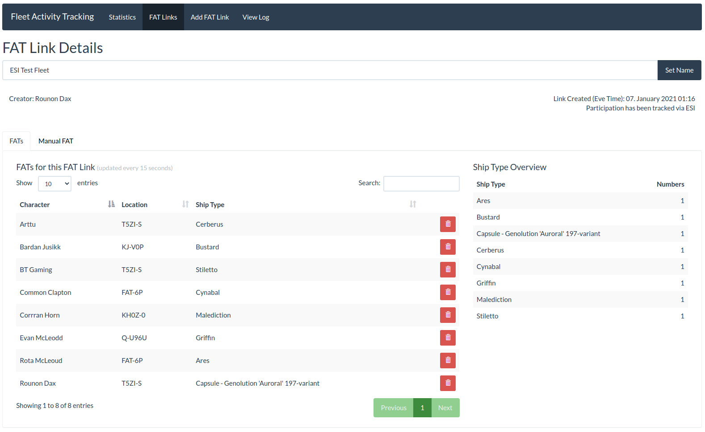
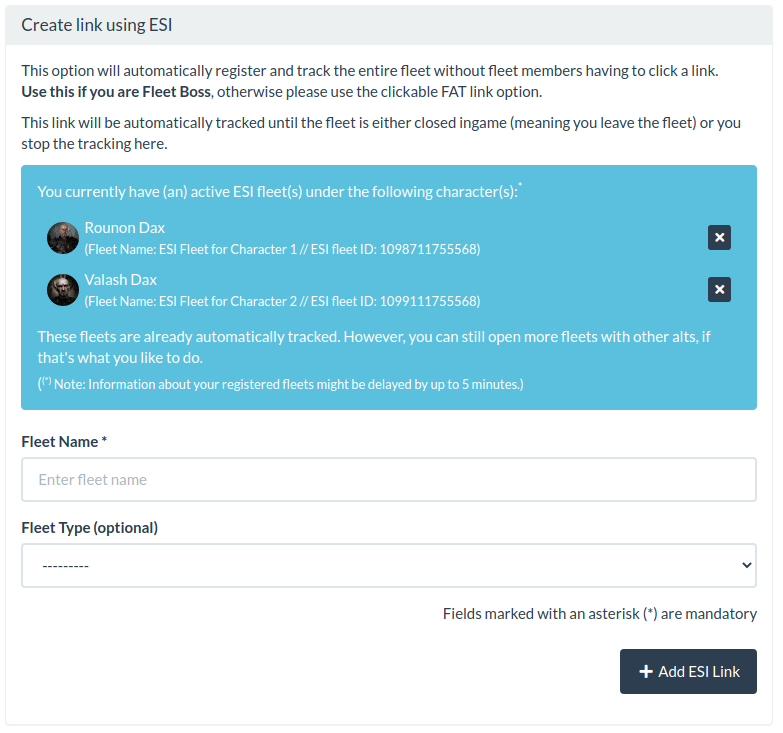

# Change Log

All notable changes to this project will be documented in this file.

The format is based on [Keep a Changelog](http://keepachangelog.com/)
and this project adheres to [Semantic Versioning](http://semver.org/).

<!--
GitHub MD Syntax:
https://docs.github.com/en/get-started/writing-on-github/getting-started-with-writing-and-formatting-on-github/basic-writing-and-formatting-syntax

Highlighting:
https://docs.github.com/assets/cb-41128/mw-1440/images/help/writing/alerts-rendered.webp

> [!NOTE]
> Highlights information that users should take into account, even when skimming.

> [!TIP]
> Optional information to help a user be more successful.

> [!IMPORTANT]
> Crucial information necessary for users to succeed.

> [!WARNING]
> Urgent info that needs immediate user attention to avoid problems.

> [!CAUTION]
> Advised about risks or negative outcomes of certain actions.
-->

## [In Development] - Unreleased

<!--
Section Order:

### Added
### Fixed
### Changed
### Deprecated
### Removed
### Security
-->

### Added

- Smart Filter: FATs in time period
- Dependency to `django-eveuniverse`

### Update Instructions

> [!IMPORTANT]
>
> **New Dependency:** `django-eveuniverse`
>
> After updating to this version and **before** running the DB migrations,
> please make sure to add `eveuniverse` to the list of installed apps
> in your `local.py` file:

```python
INSTALLED_APPS += [
    "eveuniverse",
]
```

Then run the following commands:

```bash
python manage.py migrate
python manage.py afat_load_shiptypes
```

## [3.8.2] - 2025-05-17

### Fixed

- Icon for the FAT delete button in FAT link details view

## [3.8.1] - 2025-05-05

### Fixed

- Permission check in the templates for the FAT link tables

## [3.8.0] - 2025-04-23

### Added

- Alt information in mains' corp statistics member details

### Fixed

- Statistics for alts in a different corp
- Historic data in statistics. Up until now, corporation and alliance statistics were
  calculated with the characters' current association. This has been changed to use the
  character association at the time of the FAT link creation, to ensure that the
  statistics are correct and not changing over time. \
  Meaning, if a character left your corp, your corp lost the statistics for this
  character entirely.

### Changed

- Code for monthly corporation statistics improved
- Switch to Django `datetime` implementation for date/time handling
- Show only main characters with FATs in the member statistics overview for corporations
- Some defaults in the statistics code

### Removed

- Unnecessary checks in alliance statistics

### Update instructions

> [!IMPORTANT]
>
> After you updated to this version and ran migrations, you need to run the following
> command to migrate the characters historic association data:
>
> ```shell
> python manage.py afat_migrate_affiliation_history
> ```
>
> Depending on how many FAT links you have in total, this may take a while.

## [3.8.0-beta.5] - 2025-04-16

> [!NOTE]
>
> **This is a pre-release.** \
> Do not run this version in production yet if you don't know how to debug a
> potentially broken installation, as this version is not yet fully tested and may
> break.

### Fixed

- `if` statement in template

> [!IMPORTANT]
>
> After you updated to this version and ran migrations, you need to run the following
> command to migrate the characters historic association data:
>
> ```shell
> python manage.py afat_migrate_affiliation_history
> ```
>
> Depending on how many FAT links you have in total, this may take a while.

### Reverting the Release to Stable

In case something goes wrong, and you need to revert back to the latest stable version, run the following commands in your venv:

```shell
python manage.py migrate afat 0024
pip install 'allianceauth-afat<3.8.0'
python manage.py collectstatic
```

## [3.8.0-beta.4] - 2025-04-15

> [!NOTE]
>
> **This is a pre-release.** \
> Do not run this version in production yet if you don't know how to debug a
> potentially broken installation, as this version is not yet fully tested and may
> break.

### Added

- Alt information in mains' corp statistics member details

> [!IMPORTANT]
>
> After you updated to this version and ran migrations, you need to run the following
> command to migrate the characters historic association data:
>
> ```shell
> python manage.py afat_migrate_affiliation_history
> ```
>
> Depending on how many FAT links you have in total, this may take a while.

### Reverting the Release to Stable

In case something goes wrong, and you need to revert back to the latest stable version, run the following commands in your venv:

```shell
python manage.py migrate afat 0024
pip install 'allianceauth-afat<3.8.0'
python manage.py collectstatic
```

## [3.8.0-beta.3] - 2025-04-15

> [!NOTE]
>
> **This is a pre-release.** \
> Do not run this version in production yet if you don't know how to debug a
> potentially broken installation, as this version is not yet fully tested and may
> break.

### Changed

- Code for monthly corporation statistics improved
- Switch to Django datetime implementation for date/time handling
- Show only main characters with FATs in the member statistics overview for corporations

> [!IMPORTANT]
>
> After you updated to this version and ran migrations, you need to run the following
> command to migrate the characters historic association data:
>
> ```shell
> python manage.py afat_migrate_affiliation_history
> ```
>
> Depending on how many FAT links you have in total, this may take a while.

### Reverting the Release to Stable

In case something goes wrong, and you need to revert back to the latest stable version, run the following commands in your venv:

```shell
python manage.py migrate afat 0024
pip install 'allianceauth-afat<3.8.0'
python manage.py collectstatic
```

## [3.7.2] - 2025-04-15

### Change

- Use Bootstrap `text-bg-*` classes to make use of Bootstrap's native text-color selection

## [3.8.0-beta.2] - 2025-04-13

> [!NOTE]
>
> **This is a pre-release.** \
> Do not run this version in production yet if you don't know how to debug a
> potentially broken installation, as this version is not yet fully tested and may
> break.

### Changed

- Some minor code improvements
- Renamed the management command from `afat_fix_affiliation_in_statistics` to `afat_migrate_affiliation_history` to better reflect what it does
- Some defaults in the statistics code

### Removed

- Unnecessary checks in alliance statistics

> [!IMPORTANT]
>
> After you updated to this version and ran migrations, you need to run the following
> command to migrate the characters historic association data:
>
> ```shell
> python manage.py afat_migrate_affiliation_history
> ```
>
> Depending on how many FAT links you have in total, this may take a while.

### Reverting the Release to Stable

In case something goes wrong, and you need to revert back to the latest stable version, run the following commands in your venv:

```shell
python manage.py migrate afat 0024
pip install 'allianceauth-afat<3.8.0'
python manage.py collectstatic
```

## [3.8.0-beta.1] - 2025-04-11

> [!NOTE]
>
> **This is a pre-release.** \
> Do not run this version in production yet if you don't know how to debug a
> potentially broken installation, as this version is not yet fully tested and may
> break.

### Fixed

- Statistics for alts in a different corp
- Historic data in statistics. Up until now, corporation and alliance statistics were
  calculated with the characters' current association. This has been changed to use the
  character association at the time of the FAT link creation, to ensure that the
  statistics are correct and not changing over time. \
  Meaning, if a character left your corp this month, your corp lost the statistics
  for this character entirely.

> [!IMPORTANT]
>
> After you updated to this version and ran migrations, you need to run the following
> command to migrate the characters historic association data:
>
> ```shell
> python manage.py afat_fix_affiliation_in_statistics
> ```
>
> Depending on how many FAT links you have in total, this may take a while.

### Reverting the Release to Stable

In case something goes wrong, and you need to revert back to the latest stable version, run the following commands in your venv:

```shell
python manage.py migrate afat 0024
pip install 'allianceauth-afat<3.8.0'
python manage.py collectstatic
```

## [3.7.1] - 2025-04-09

### Added

- Type hinting for managers

### Fixed

- Spelling (It's EVE time, not Eve time)

## [3.7.0] - 2025-03-23

### Changed

- Use Celery `group` for ESI tasks to improve performance

## [3.6.1] - 2025-03-13

### Changed

- Use DataTables native translations
- Templatetag code improved
- Translations updated

## [3.6.0] - 2025-02-03

### Added

- Details button to the "Main Character » All Characters" table

### Fixed

- Sortable columns in the character FATs tables

### Changed

- Use `django-sri` for sri hashes
- Minimum requirements
  - Alliance Auth >= 4.6.0
- Character FATs table moved to its own template, so we can include it when needed instead of duplicating the template code

## [3.5.5] - 2025-01-08

### Fixed

- Ensure that translated strings in JS are properly escaped

## [3.5.4] - 2024-12-14

### Added

- Translation to all DataTables

### Fixed

- Correct User Agent string used for ESI calls

### Changed

- Element spacing in some views for better readability
- Translations updated

## [3.5.3] - 2024-12-12

### Fixed

- Reintroduced corp stats table for all characters (#381)

### Changed

- A little bit of JS rework
- Translations updated

## [3.5.2] - 2024-12-06

### Added

- Python 3.13 to test matrix

### Fixed

- Colspan in affected tables

### Changed

- Better implementation of `get_solo()`

## [3.5.1] - 2024-12-01

### Fixed

- Month order in alliance stats view (#377)

### Changed

- Chinese translation updated

## [3.5.0] - 2024-11-28

### Fixed

- Broken corporation performance graph in alliance statistics view

### Changed

- Autocomplete JS updated
- Corporation statistics pages improved

## [3.4.0] - 2024-11-09

> [!IMPORTANT]
>
> After updating to this version, make sure to run the following
> command to migrate the old fleet types to the new system:
>
> ```shell
> python manage.py afat_migrate_fleet_types
> ```

### Added

- Optional doctrine field to FAT link creation forms
- Integrity hashes to CSS and JavaScript

### Fixed

- ESI fleet closing condition. When the FC left the fleet and is now in another
  fleet, the previous fleet was not detected as no longer tracked, and as such, not
  closed until the FC is either in no fleet at all or offline.

### Changed

- Settings from `local.py` moved to DB
- Fleet type dropdown to auto-suggest field

### Removed

- `AFAT_APP_NAME` setting to ensure the app name can be properly localized

## [3.3.0] - 2024-11-06

### Added

- Monthly total FATs to statistics overview

### Changed

- Use Chart.js bundled with Alliance Auth
- Dependencies updated
  - `allianceauth`>=4.4.0

## [3.2.0] - 2024-09-16

### Changed

- Dependencies updated
  - `allianceauth`>=4.3.1
- French translation improved
- Japanese translation improved
- Lingua codes updated to match Alliance Auth v4.3.1

## [3.1.0] - 2024-07-30

### Changed

- URL generation modularized
- French translation updated
- Japanese translation updated

### Removed

- Support for Python 3.8 and Python 3.9

## [3.0.2] - 2024-06-06

### Fixed

- Lack of authorization check when requesting recent FatLinks in Dashboard Ajax call.
  This could lead to unauthorized access to FatLinks of other users. ([#337](https://github.com/ppfeufer/allianceauth-afat/issues/337))

### Changed

- Chinese translation updated
- Russian translation updated

## [3.0.1] - 2024-05-16

### Change

- Translations updated

## [3.0.0] - 2024-03-16

> [!NOTE]
>
> **This version needs at least Alliance Auth v4.0.0!**
>
> Please make sure to update your Alliance Auth instance **before**
> you install this version, otherwise, an update to Alliance Auth will
> be pulled in unsupervised.

### Added

- Compatibility to Alliance Auth v4
  - Bootstrap 5
  - Django 4.2
- Show the main character first on the dashboard page

### Fixed

- Some issues with the translations in the Python code
- Issues with translations in the Django admin backend
- Stats graph appearance
- A bug where the previous or next month number wasn't calculated correctly in the statistics detail view
- A bug where the next month button in the statistics detail view was not displayed correctly
- A potential performance issue with an ajax call in the dashboard view (thx to @pvyParts)

### Changed

- JS modernized
- CSS modernized
- Templates changed to Bootstrap 5

### Removed

- Support for Alliance Auth 3

## [3.0.0-beta.3] - 2024-03-05

> [!NOTE]
>
> **This version needs at least Alliance Auth v4.0.0b2!**
>
> Please make sure to update your Alliance Auth instance **before**
> you install this version, otherwise, an update to Alliance Auth will
> be pulled in unsupervised.

### Fixed

- A potential performance issue with an ajax call in the dashboard view (thx to @pvyParts)

## [3.0.0-beta.2] - 2024-03-04

> [!NOTE]
>
> **This version needs at least Alliance Auth v4.0.0b2!**
>
> Please make sure to update your Alliance Auth instance **before**
> you install this version, otherwise, an update to Alliance Auth will
> be pulled in unsupervised.

### Fixed

- Stats graph appearance
- A bug where the previous or next month number wasn't calculated correctly in the statistics detail view
- A bug where the next month button in the statistics detail view was not displayed correctly

## [3.0.0-beta.1] - 2024-02-25

> [!NOTE]
>
> **This version needs at least Alliance Auth v4.0.0b2!**
>
> Please make sure to update your Alliance Auth instance **before**
> you install this version, otherwise, an update to Alliance Auth will
> be pulled in unsupervised.

### Added

- Compatibility to Alliance Auth v4
  - Bootstrap 5
  - Django 4.2
- Show the main character first on the dashboard page

### Fixed

- Some issues with the translations in the Python code
- Issues with translations in the Django admin backend

### Changed

- JS modernized
- CSS modernized
- Templates changed to Bootstrap 5

### Removed

- Support for Alliance Auth 3

## [2.13.0] - 2023-09-26

> [!NOTE]
>
> **This is the last version compatible with Alliance Auth v3.**

### Fixed

- Pylint issues
- Import from `app_utils`
- Capitalization for translatable strings

### Changed

- German translation improved
- Korean translation improved
- Russian translation improved
- Spanish translation improved
- Use keyword arguments wherever possible
- Model names
- Some model field names
- Test suite updated

### Removed

- Import from ImicusFAT (ImicusFAT has been gone for a while now and doesn't work
  with Alliance Auth >= 3.0.0. Whoever is still using it, should feel bad and
  immediately update their systems.)
- Manual FAT model. This has been deprecated back in April 2021, so it's time to
  remove it.

## [2.12.3] - 2023-09-02

### Changed

- Korean translation improved
- Russian translation improved
- Spanish translation improved

## [2.12.2] - 2023-08-13

### Fixed

- Bootstrap CSS fix

## [2.12.1] - 2023-07-30

### Added

- Footer to promote help with the app translation

### Changed

- German translation improved
- Russian translation improved
- Ukrainian translation improved

## [2.12.0] - 2023-04-21

### Added

- Models made translation-ready

### Changed

- Translatable strings properly pluralized
- Task code cleaned up
- Error tracking for ESI fleets moved to the DB instead of being cached by Redis, as
  Redis was too unreliable and there was a good chance the task stopped working
  properly.
- German translation updated
- Russian translation updated

## [2.11.3] - 2023-04-13

### Changed

- German translation updated

## [2.11.2] - 2023-03-25

### Fixed

- Include Sunday in statistics again (Related to [#251])

## [2.11.1] - 2023-03-06

### Fixed

- FATs by Weekday for Alliance are off by one day

## [2.11.0] - 2023-03-06

### Fixed

- Only show active fleet types in FAT link form
- FATs by Weekday for Corp are off by one day ([#251])

### Added

- Check if ESI is available (ESI is online and below error limit) before running
  `update_esi_fatlinks` task

### Changed

- Russian translation updated
- German translation updated

## [2.10.2] - 2022-10-16

### Fixed

- Hide hint text behind the permissions the users should have to see it
- Bottom margin in some statistics views

## [2.10.1] - 2022-10-12

### Fixed

- Show FAT Link register link only for clickable FAT links

### Removed

- Auto retry for ESI and OS errors in tasks, since django-esi already retries all
  relevant errors

## [2.10.0] - 2022-10-06

### Changed

- Using `SITE_URL` now in the templates instead of
  `{{ request.scheme }}://{{ request.get_host }}`
- Minimum requirements:
  - `allianceauth>=3.2.0`

## [2.9.7] - 2022-08-11

### Update Information

Before you update to this version, make sure you have at least Alliance Auth v2.15.1
installed, otherwise, this update will pull in Alliance Auth 3.x unsupervised with
breaking changes. (See [Alliance Auth 3.0.0 release notes](https://gitlab.com/allianceauth/allianceauth/-/tags/v3.0.0))

### Added

- Instructions on how to uninstall `ImicusFAT` after data migration to README

### Changed

- CSS modernized
- CSS and JS moved to their own bundled HTML templates
- Deprecated `type` attributes removed form `style` and `script` tags
- Minimum requirements:
  - `allianceauth>=2.15.1`
  - `allianceauth-app-utils>=1.14.1`
  - `unidecode>=1.3.4`
  - `python>=3.8`

## [2.9.6] - 2022-07-29

### Fixed

- Missing JS re-added

## [2.9.5] - 2022-07-29

### Fixed

- Duplicate Key Error during ESI fleet tracking (This time for good ... I hope :-P)

### Removed

- Explicit `django-esi` dependency from `setup.cfg` since it's already pulled in by
  `allianceauth` itself
- Deprecated `MANIFEST.in` file

## [2.9.4] - 2022-07-12

### Fixed

- JS template order

## [2.9.3] - 2022-07-12

### Changed

- Form for "Manual FAT" re-activated again

## [2.9.2] - 2022-07-11

### Changed

- Form for "Manual FAT" is temporarily deactivated since CCP just announced that the
  `/search` ESI endpoint will be removed tomorrow (probably during downtime) for good,
  which was used for this feature. Alternatives that would make this feature work
  as it was until now are currently unavailable. Say "Thank You CCP" ...

## [2.9.1] - 2022-07-11

### Added

- Data migration from ImicusFAT: Workaround for ImicusFAT bug
  [!43](https://gitlab.com/evictus.iou/allianceauth-imicusfat/-/issues/43) added. It
  is not a work of art but should mitigate the issue. Thanks to @pvyParts for the idea.

## [2.9.0] - 2022-07-11

### Changed

- Use bundled JS provided by AA
- Minimum Requirement
  - Alliance Auth >= 2.14.0

### Removed

- Unused JavaScript

## [2.8.6] - 2022-06-23

### Fixed

- Apparently, I did it wrong and `get_or_create` was throwing errors. Should be
  fixed now

## [2.8.5] - 2022-06-16

### Fixed

- Another attempt to fix the Duplicate Key Error that still happens from time to
  time. This is - to my analysis - because ESI is not fast enough to handle all
  the calls between the task runs. So we let Django handle it now, hopefully.

## [2.8.4] - 2022-05-02

### Fixed

- Duplicate Key error by moving check if character exists to `process_character`
  function instead of `process_fats` function

## [2.8.3] - 2022-04-28

### Fixed

- Access to character statistics

## [2.8.2] - 2022-04-25

### Fixed

- More permission fixes for statistics

## [2.8.1] - 2022-04-25

### Changed

- JavaScript modernized

### Fixed

- An issue where a user can't see other characters statistics despite having the
  right permissions

## [2.8.0] - 2022-03-02

### Added

- Test suite for AA 3.x and Django 4

### Changed

- Switched to `setup.cfg` as config file, since `setup.py` is deprecated now

### Removed

- Deprecated settings

## [2.7.0] - 2022-02-28

### Fixed

- [Compatibility] AA 3.x / Django 4 :: ImportError: cannot import name
  'ugettext_lazy' from 'django.utils.translation'

## [2.6.0] - 2022-02-02

### Changed

- `models.TextChoices` refactored for better code readability
- Using `path` in URL config instead of soon-to-be removed `url`

## [2.5.0] - 2022-01-26

### Changed

- Improvements to try/except blocks

### Removed

- Import from bFAT. bFAT is deprecated since quite some time now and by now everyone
  who was using it should have updated to a working and supported FAT module.

## [2.4.0] - 2022-01-12

### Changed

- JavaScript: `const` instead of `let` where ever appropriate
- Minimum requirements
  - Alliance Auth v2.9.4

## [2.3.3] - 2022-01-05

### Changed

- `update_esi_fatlinks` task chain improved, so the sub-task `process_character` is
  only fired for new pilots in fleet, not for every pilot

## [2.3.2] - 2022-01-04

### Added

- `afat_static` template tag to break browser cache for selected CSS and JS files on
  app update

### Changed

- Code modernized
- Cleanup for ImicusFAT migration moved to migration command and removed from README
  (Meaning: No more manual preparation needed when migrating from ImicusFAT to AFAT)

## [2.3.1] - 2022-01-04

### Removed

- Unused `DEFAULT_TASK_PRIORITY` setting for tasks
- Commented code that's no longer used

### Fixed

- Slugified links with unicode characters in `AFAT_APP_NAME`

## [2.3.0] - 2021-11-30

### Changed

- DataTables keep their state (Page and number of entries per page) for the current
  session.
- Minimum requirements
  - Python 3.7
  - Alliance Auth v2.9.3

## [2.2.20] - 2021-11-21

### Updated

- Russian and German translations (We should have it all now ...)

## [2.2.19] - 2021-11-20

### Updated

- Russian and German translations

## [2.2.18] - 2021-11-17

### Fixed

- Month numbers are integers not strings

### Updated

- Russian translation

## [2.2.17] - 2021-11-17

### Added

- Russian translation (Thanks to -7- [0RIG] Neomad Miromme)

### Fixed

- Spelling in some templates
- Sorting of months in statistics view

## [2.2.16] - 2021-11-17

### Added

- German translation

## [2.2.15] - 2021-11-10

### Fixed

- TypeError in convert_fats_to_dict() When fleet (name) Is NULL/None (#115)

## [2.2.14] - 2021-11-05

### Fixed

- User with `manage_afat` permission now have access to the logs as well, as they
  should have from the beginning

## [2.2.13] - 2021-11-04

### Added

- Activate and Deactivate actions in admin backend for fleet types now throw
  an error message if they error out for some reason

## [2.2.12] - 2021-10-31

### Changed

- Minimum version for `allianceauth-app-utils` set to 1.8.1

## [2.2.11] - 2021-10-17

### Changed

- Automatically reload information in fatlink detail view only when the fleet is
  still tracked/active

## [2.2.10] - 2021-10-05

### Changed

- Some checks for object existence improved

### Fixed

- An import from the wrong module

## [2.2.9] - 2021-10-03

### Fixed

- A possible "division by zero" error in corp statistics

## [2.2.8] - 2021-10-01

### Added

- Basic code coverage test
- Code of Conduct

### Changed

- GitHub Templates

## [2.2.7] - 2021-08-02

### Fixed

- Only show characters with FATs in statistics overview
- Sort by month in statistics overview
- Expected parentheses around arrow function argument

## [2.2.6] - 2021-07-15

### Fixed

- Prevent double submit of forms, to stop multiple manual FAT links from being
  created if someone double-clicks (or more) on the "Create Link" button

## [2.2.5] - 2021-07-12

### Fixed

- Next and current month buttons in corp stats

## [2.2.4] - 2021-07-12

### Fixed

- Error 500 due to non existent EveCorporationInfo objects

## [2.2.3] - 2021-07-08

### Added

- Checked for compatibility with Python 3.9 and Django 3.2

## [2.2.2] - 2021-06-20

### Changed

- Admin views are now searchable
- Manual log removed from admin view. This should be migrated by now to the new
  combined log. If you haven't done so yet, see
  [update instructions for v2.0.0](#-update-instructions-for-v200-) please

## [2.2.1] - 2021-06-17

### Changed

- JS modernized
- FAT link hash creation, to ensure the hash is definitely unique (Not that it
  wasn't before, but now it is enforced via its DB table field)

## [2.2.0] - 2021-05-11

### Fixed

- Using Django application registry instead of directly accessing `INSTALLED_APPS`
- Using Django messages API (#86)

### Added

- Index to `hash` field in AFatLink model (Thanks @ErikKalkoken)

### Changed

- Time period (year and month select) templates refactored
- FAT link hashes in log are now linked to their respective FAT link details, as
  long as the FAT link is not deleted yet (Thanks to @ErikKalkoken to let me know
  how to do so without firing potentially hundreds of queries against the database)
- Reduced load time for all pages incl. admin site (Thanks @ErikKalkoken)

## [2.1.1] - 2021-04-30

### Added

- Button to close your own ESI fleet to more view. It is now available on the
  Dashboard, in the FAT link list and in the FAT link details view as well. You can
  only close your own ESI fleets.

### Changed

- Manual FAT function limited. It is only available when the FAT link has been
  created within the last 24 hours and has not been re-opened.
- Message templates refactored to make them more maintainable

## [2.1.0] - 2021-04-22

### Changed

- Ability to manually add pilots to FAT link has been disabled for ESI tracked FAT
  links. The reason for this is pretty simple. Since an ESI tracked FAT link is
  continuously tracking the fleet via ESI, all pilot who have been in said fleet are
  added automatically. If someone hasn't been added, said someone wasn't in the fleet.

### ⚠️ Important ⚠️

If you haven't updated to the v2 version yet, do so first and do not go straight to
this version. Read the [update instructions for v2.0.0 please](#-update-instructions-for-v200-)
please.

## [2.0.1] - 2021-04-22

### Fixed

- `django.db.utils.IntegrityError: (1048, "Column 'log_time' cannot be null")` on
  log merge.

### ⚠️ Important ⚠️

If you haven't updated to the v2 version yet, do so first and do not go straight to
this version. Read the [update instructions for v2.0.0 please](#-update-instructions-for-v200-)
please.

## [2.0.0] - 2021-04-21

### Fixed

- Error 500 due to missing `EveAllianceInfo` object in statistics view
- Clear content of modal windows when they are closed
- Unique IDs for modals

### Added

- `related_name` to foreign keys in models
- Proper log model
- Proper log messages to fatlink detail view and edit actions to differenciate if
  someone is only viewing or actually editing some details
- Confirmation modal window when closing ESI fleets manually
- Ability to re-open clickable FAT links for a certain time after they have expired.
  FAT links can be re-opened only once though (`manage_afat` permissions are needed
  to re-open FAT links)
- Logs view (`log_view` permissions are needed to view the logs)

### Changed

- Inline JS for DataTables moved to their own files
- Templates restructured
  - Proper directory structure
  - Proper names
- Links restructured
  - Some changes in link names (mostly for ajax calls)
  - Link segment order unified
- Function names following a proper naming convention
- Use swagger spec provided by CCP instead of maintaining our own file
- Migration from ImicusFAT now writes into the new AFAT log table
- Migration from bFAT now writes into the new AFAT log table
- Migration from native FAT module now writes into the new AFAT log table
- Wording in modal windows
- Modal windows merged into one file which is loaded conditionally
- Log messages improved
- Manual FAT log deactivated in favor of the new general log
- Forms for FAT link creation now properly using django forms

### Removed

- Old code for flat lists. Not used anymore and will not be used ever again

### ⚠️ Update Instructions for v2.0.0 ⚠️

______________________________________________________________________

#### If you are updating from one of the 2.0.0-alpha versions

If you installed one of the alpha versions, make sure to reset your migrations first!
Migrations have been reset during the alpha versions a couple of times.

To do so, run:

```shell
python manage.py migrate afat 0017
```

Once done, proceed with the update as lined out below.

______________________________________________________________________

This release introduces a new periodic task, make sure to add it to your `local.py`,
besides that, it is the usual steps to update ...

Download and install the new version

```shell
pip install -U allianceauth-afat
```

Add the new task to your `local.py`

```python
CELERYBEAT_SCHEDULE["afat_logrotate"] = {
    "task": "afat.tasks.logrotate",
    "schedule": crontab(minute="0", hour="1"),
}
```

Run static collection and migrations

```shell
python manage.py collectstatic
python manage.py migrate
```

Restart your supervisor.

Finally migrate the Manual FAT log to the new logging table

```shell
python manage.py afat_migrate_manual_fat_log
```

## [1.10.0] - 2021-03-30

### ⚠️ IMPORTANT ⚠️

Before you update to this version, make sure you remove all "deleted" data from
your tables. To do so, log in to your mysql console and run the following commands:

```mysql
# de-activate foreign key checks
SET FOREIGN_KEY_CHECKS=0;

# remove all "deleted" FATs
delete from afat_afat where deleted_at is not null;

# remove all "deleted" fat link types
delete from afat_afatlinktype where deleted_at is not null;

# get all fatlink IDs of "deleted" fatlinks as comma separated list and make sure
# to have that in your notepad saved, you need this list for the next comamnds
select group_concat(id) from afat_afatlink where deleted_at is not null;

# now remove everything that is related to those IDs
# make sure to replace "id_list" with the comma separated
# list of IDs from the earlier command
delete from afat_clickafatduration where fleet_id in (id_list);
delete from afat_afat where afatlink_id in (id_list);
delete from afat_afatlink where id in(id_list);

# re-activate foreign key checks
SET FOREIGN_KEY_CHECKS=1;
```

This step is important before updating, because the "deleted" marker will be lost
during migration! If you don't run this step, you'll have all your FATlinks and FATs
that were previously "deleted" as active again.

### Removed

- Soft deletion mechanism we inherited from ImicusFAT. It's more trouble than it's worth
  and it's not used anyways. So we stick to "delete data when it should be deleted",
  and not just mark it as deleted and keep it as stale data in the table.

### Updated

- Migration information for migration from ImicusFAT in README.md file

## [1.9.0] - 2021-03-20

### Added

- Ship type overview to FAT link detail page (#72)

  

## [1.8.0] - 2021-03-07

### Added

- Ability to "close" ESI fat links manually. (Only the FC creating the link has this
  ability when creating new ESI fat links when he still has registered fleets.)

  

## [1.7.0] - 2021-03-02

### Added

- Setting to change the application name, in case you want it named something specific

## [1.6.0] - 2021-02-04

### Added

- Info when there are already registered ESI links for the FC and with which characters
- A check for already registered fleets on ESI link creation. If the character
  already has a fleet registered, and it is hte same fleet, he gets a message. If it
  is a new fleet, the old fleet will be closed, and the new fleet will be registered.

## [1.5.3] - 2021-02-03

### Fixed

- An issue with sorting by date in datatables

## [1.5.2] - 2021-02-02

### Changed

- Tables look and feel
  - Removed the "actions" header
  - Added hover effect to all tables
  - Added common table style

## [1.5.1] - 2021-01-27

### Changed

- EVE/UTC tz handling optimized

## [1.5.0] - 2021-01-25

### Added

- Ability to create ESI fat links on alts, in case the FC has another fleet on one
  of their alts up and running
- More ESI error handling

## [1.4.5] - 2021-01-20

### Changed

- Views imports optimized

### Fixed

- An issue when the FC switched to another fleet. This was not detected properly, and
  the "old" ESI link was not closed.

## [1.4.4] - 2021-01-11

### Added

- Option to set the default expiry time for clickable FAT links in minutes. If
  nothing es set, 60 minutes will be assumed as default.

## Changed

- Permissions have been completely overhauled and simplified

  | Name                    | Description                              | Notes                                                                                                                                                                           |
  | :---------------------- | :--------------------------------------- | :------------------------------------------------------------------------------------------------------------------------------------------------------------------------------ |
  | basic_access            | Can access the AFAT module               | Your line member probably want this permission, so they can see the module and click the FAT links they are given. They also can see their own statistics with this permission. |
  | manage_afat             | Can manage the AFAT module               | Your Military lead probably should get this permission                                                                                                                          |
  | add_fatlink             | Can create FAT Links                     | Your regular FC or who ever should be able to add FAT links should have this permission                                                                                         |
  | stats_corporation_own   | Can see own corporation statistics       |                                                                                                                                                                                 |
  | stats_corporation_other | Can see statistics of other corporations |                                                                                                                                                                                 |

  **Please make sure to read the following before updating!**

  Permissions have been completely redone and simplified. This means, the current
  permissions will no longer apply after the update. Time to clean them up! In order
  to do so, run the following commands **in exactly this order!**

  - _Update the software itself:_

    ```shell
    pip install -u allianceauth-afat
    ```

  - _Open a django console:_

    ```shell
    python manage.py shell
    ```

  - _Remove the modules old permissions:_

    ```python
    from django.contrib.auth.models import Permission

    Permission.objects.filter(content_type__app_label="afat").delete()
    exit()
    ```

  - _Run static collection and migrations:_

    ```shell
    python manage.py collectstatic
    python manage.py migrate
    ```

  **Keep in mind, you have to set the new permission to the states/groups that
  previously had permissions.**

## [1.4.3] - 2021-01-08

### Fixed

- Deal with invalid user profiles. For example when a user has revoked his/her ESI
  access.

## [1.4.2] - 2021-01-07

### Added

- Useragent to ESI calls

### Changed

- Ajax URLs structured
- Internal methods for afat_view renamed to dashboard
- Views modularized
- Dashboard static tables replaced with DataTables which get populated via Ajax calls
- Fleet Edit FAT list table replaced with DataTable
- Statistics now only show alliances and corps when their members have access to the
  module, not just all anymore

### Fixed

- Missing fleet commander added to ESI FAT links. Now the automatic ESI pull also
  works when the fleet commander is an alt of the creator
- Length of form fields adjusted
- Hardened the auto ESI pull against possible ESI hiccups, so ESI FAT links are not
  closed prematurely

## [1.4.1] - 2020-12-24

### Added

- Explanation for the "via Esi" labels in FAT list view
- New "via Esi" label for currently active ESI links

### Fixed

- Prevent user from opening more than 1 ESI fleet

## [1.4.0] - 2020-12-24

### New

ESI links will now be updated automagically. This means, pilots who join later will
still be registered, as long as the FC who created the ESI link is still the actual
fleet boss and didn't close or leave the fleet.

## [1.3.4] - 2020-12-16

### Fixed

- Bootstrap classes in template

## [1.3.3] - 2020-11-28

### Changed

- Reducing characters displayed on stats main view to only those with FATs

### Fixed

- 'NoneType' object has no attribute 'character_name'
  (This happens when the creator of a FAT link for what ever reason lost his main char
  and prevents the FAT link list from being loaded.)

## [1.3.2] - 2020-11-23

### Changed

- couple of tweaks to templates and JS
- show only characters with FAT links in stats main view

## [1.3.1] - 2020-11-22

### Changed

- tables tweaked …
  - preventing DataTables from getting wider than their parent element
  - even/odd styles
  - text alignments

## [1.3.0] - 2020-11-19

### New Feature

- Import scripts for imports from Alliance Auth's FAT module as well as from bFAT
  and ImicusFAT. These imports can be done initially right after the first install of
  AFAT. Fiddling around with SQL to import is no linger needed with this.

### Added

- Filter to the Fat Links List view. You can now filter for Fleet Type and is a
  FAT link was created via ESI or not in the FAT links list.

### Changed

- FAT links information in FAT links list is now loaded via ajax. This means, especially
  for installations with a large number of FAT links, this page should be loaded considerably faster.
- Minimum required version of Alliance Auth set to 2.8.0

### Removed

- Support for Django 2

## [1.2.0] - 2020-10-19

### New

- Added a check to `Clickable FATLinks` to verify whether the character is
  actually online.

### Changed

- Workflow improvements for `ESI FATLinks`
- Show only chars with recent activity in "Recent Activity" view

### Fixed

- Added Average FATs to the monthly corp stats overview.
- Added "Basic Access" permission. This permission prevents unintended audience
  from accessing the module.

### Updating

**IMPORTANT**:
When updating to this version, you will need to give the state/group that should have
access to the AFAT module the
`afat|Alliance Auth AFAT|Can access the Alliance Auth AFAT module` permission.
Without this permission, the user cannot see the link, open any statistics or register
via clickable FATLinks.

To update your existing installation of AFAT, first enable your virtual environment
(venv) of your Alliance Auth installation.

```bash
pip install -U allianceauth-afat

python manage.py collectstatic
python manage.py migrate
```

Finally restart your supervisor services for AA

## [1.1.0] - 2020-10-05

### Changes to the URL structure

#### Renamed URL parts

- `stats` to `statistic`
- `ally` to `alliance`
- `corp` to `corporation`
- `char` to `character`

#### Changed URL parts

- `month/year` to `year/month` (this is to enable us to have yearly statistics
  for certain views)

### Added / Changed behavior

- Added a year switch to main statistics view
- Added a year switch to corporation statistics view
- Added a year switch to alliance statistics view
- Changed the fatlink list to be restricted to a year
- Added year switch to fatlink list
- Added manual FAT log to admin page as read only

### Fixed

- Deleted FATs have not been logged

## [1.0.0] - 2020-09-28

### Added

- Marking fatlinks done via ESI as such in fatlink lists
- Filter to the admin backend
- Enable/Disable fleet types in admin view
- Some more information has been added to the admin view
- Better permission handling in templates

### Checked

- Django 3 compatibility
  (for AA 2.8.0 - https://gitlab.com/allianceauth/allianceauth/-/issues/1261)

### Changed

- Minimum required Alliance Auth version

### Fixed

- Fleet edit form
- Permissions to edit and delete fatlinks and fats

## [1.0.0a1] - 2020-09-22

### New

- Some more information has been added to the admin view
- Better permission handling in templates
- Django 3 compatibility
  (for AA 2.8.0 - https://gitlab.com/allianceauth/allianceauth/-/issues/1261)

### Changed

- Minimum required Alliance Auth version

### Fixed

- Permissions to edit and delete fatlinks and fats
- Templates prepared for Django 3 update in Alliance Auth

## [0.3.5] - 2020-09-11

### Added

- Month navigation to stats detail pages to review older stats

### Changed

- baseurl from `afat` to `fleetactivitytracking`
- hard coded links replaced

### Fixed

- an issue with "No Alliance" in stats view
- fleet types are now sorted alphabetically

## [0.3.5] - 2020-08-31

### Changed

- Can Only Create ESI Link if Fleet Boss
- Show Clickable Link Only When Still Valid
- Various Formatting Enhancements

### Removed

- Remaining Flat List Fragments

### Fixed

- ESI FAT Messages
- Various Formatting Enhancements

[#251]: https://github.com/ppfeufer/allianceauth-afat/issues/251 "FATs by Weekday for Corp are off by one day"
